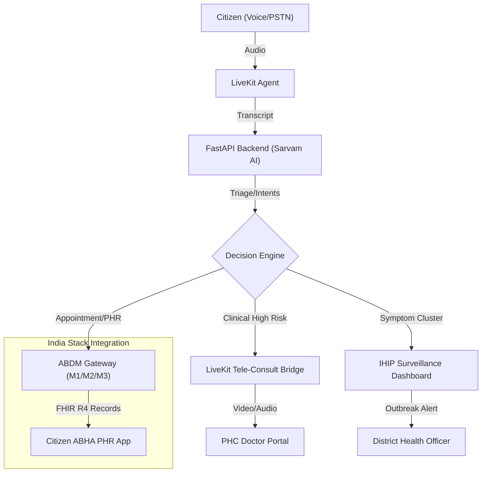

# Citizen Health AI (Aarogya) — v3.0 Deep Implementation Plan

This document provides a deeply researched, multi-phase roadmap for evolving Aarogya into a national-scale public health ecosystem, fully aligned with India's **Ayushman Bharat Digital Health Mission (ABDM)** and **Integrated Health Information Platform (IHIP)**.

---

## 🏗️ System Architecture Overview

The following diagram illustrates the flow from a citizen's voice turn to clinical action, surveillance reporting, and digital health records.

---

## 🏥 Module 1: ABDM Compliance (M1, M2, M3)

To ensure interoperability with the national digital health ecosystem, Aarogya must implement the **Ayushman Bharat Digital Health Mission** milestones:

### 1.1 M1: Identity (ABHA ID)
*   **Implementation**: Use the **ABDM Sandbox APIs** for ABHA creation via Aadhaar/Mobile OTP.
*   **Voice Flow**: The agent asks for Aadhaar, then prompts for the OTP sent to the user's mobile.
*   **Research Note**: ABHA is the foundation for all subsequent clinical data linking.

### 1.2 M2: Health Information Provider (HIP)
*   **Implementation**: Map Aarogya's appointment and triage data to **FHIR R4 Standards**.
*   **Specific Profiles**:
    *   `OPConsultRecord`: Capture the AI triage results and doctor's notes.
    *   `PrescriptionRecord`: Digitize medicine advice.
*   **Care Context**: Every voice interaction generates a `careContextReference` linked to the citizen's ABHA.

### 1.3 M3: Health Information User (HIU)
*   **Implementation**: Implement the **Fidelius** encryption service for secure, consent-based exchange.
*   **Value**: The agent can ask: *"Meena, can I view your previous records from the District Hospital to help you better?"*

---

## 📊 Module 2: Syndromic Surveillance (IHIP Integration)

Aarogya acts as an automated, real-time "First Responder" for the **Integrated Health Information Platform (IHIP)**.

### 2.1 Syndromic Mapping (S-Form)
The system maps AI-detected symptoms to IHIP's 33 priority conditions:
*   **Fever + Rash** → Map to *Meningitis/Dengue* (S-Form S2).
*   **Cough + Breathing Difficulty** → Map to *SARI/ILI* (S-Form S1).
*   **Diarrhea (3+ times)** → Map to *Acute Diarrheal Disease* (S-Form S3).

### 2.2 Outbreak Heatmaps
*   **Technology**: **PostGIS** for geospatial aggregation.
*   **Rationale**: By identifying clusters at the village level (disaggregated data), the PHC can deploy ASHA workers for contact tracing 48-72 hours faster than traditional clinical reporting.

---

## 🎙️ Module 3: NCD Proactive Care (National 75/25 Initiative)

India’s **"National 75/25 Initiative"** aims for 75 million people with hypertension/diabetes to be on standardized care by 2025. Aarogya supports this through **Voice-First Chronic Management**.

### 3.1 Adaptive Vitals Tracking
*   **Research**: Voice-AI is the only effective medium for the 30% of the rural population with low text-literacy.
*   **Flow**:
    1.  **Scheduled Outbound Call**: "It's time for your check-up."
    2.  **Voice Entry**: Patient says "140 over 90."
    3.  **NLP Parsing**: Extract `bp_systolic` and `bp_diastolic`.
    4.  **Automatic Escalation**: If vitals are in the "Crisis" range, the system triggers an immediate Tele-Consult.

---

## 🛠️ Technical Specifications & Security

### 4.1 Data Privacy (DISHA & GDPR)
*   **Encryption**: All PII (Personally Identifiable Information) and health data encrypted at rest (AES-256) and in transit (TLS 1.3).
*   **Consent Manager**: Integration with the ABDM Consent Manager so citizens can revoke access to their data at any time.

### 4.2 LiveKit Scaling for Clinical Use
*   **Infrastructure**: Multi-node SFU (Selective Forwarding Unit) cluster for high availability.
*   **Security**: Media streams secured via **DTLS/SRTP**; every room is dynamically partitioned by `session_id`.

---

## 📅 Roadmap 2024-2025

| Phase | Milestone | Objective |
| :--- | :--- | :--- |
| **Q3 2024** | **ABDM M1 & M2** | Enable ABHA creation and data linking. |
| **Q4 2024** | **IHIP Syndromic Flow** | Real-time symptom reporting to District Dashboards. |
| **Q1 2025** | **75/25 NCD Module** | Launch automated Hypertension/Diabetes tracking. |
| **Q2 2025** | **Tele-Consult Bridge** | Full "AI-to-Human" handover capabilities. |

---

> [!IMPORTANT]
> The success of v3.0 depends on **clinical trust**. All AI-driven advice (Triage) must be periodically reviewed by PHC Medical Officers using the "Sahayak" Dashboard to ensure alignment with local clinical guidelines.
